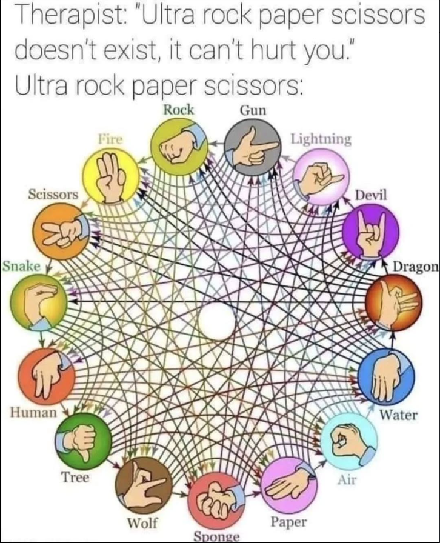

# AplicacionesJS
En este repositorio creare multiples aplicaciones y retos con el lenguaje JS

# PIEDRA, PAPEL y TIJERAS (ADVANCE)

Este es el tipico de Piedra papel y tijeras pero con un mayor integracion de posibilidades de juego inpirado en un meme que vi y creo que tiene un potencial genial.
# 

  

#

Como seria bastante facil hacer el juego con simples botones y valores decidi ir por el camino de la logica, investigando un poco me di cuenta de que el juego puede resolverse con matematicas y que el numero de variables dentro del juego se puede aumentar dependiendo de unicamente estos valores que podemos asignar.

esta respuesta de reddit explica un poco mejor el como se resuelve este juego de una fomra matematica bastante simple pero efectiva.

[[Mathematics behind "rock paper scissors"-like games?]](https://www.reddit.com/r/math/comments/3k4imj/comment/cuuqcco/?utm_source=share&utm_medium=web3x&utm_name=web3xcss&utm_term=1&utm_content=share_button)

https://en.wikipedia.org/wiki/Nash_equilibrium

## ESTILO Y DISENO
Ademas como un experimetno personal implemente varios estilos de tendencias como el glassmorphism y felxbox en css ademas de que yo mismo cree animaciones para que el sitio no sea tan aburrido y recuerde a como eran los videojuegos del antiguo internet.

## 🛠 Lenguajes y herramientas
Este proyecto se creo usando el patron MVC en JavaScript para pode hacer funcionar la logica del juego ademas de este lenguaje y framework:

- 
- 

## INTERESES Y OBJETIVOS PERSONALES
👩‍💻 Actualmente trabajando en proyectos para mi portafolio

🧠 Actualmente estoy interesado en: python, JavaScript, React

📫 Contactame: [Mi linkedin](www.linkedin.com/in/samuel-salcedo-lucero-8a26041b8)

